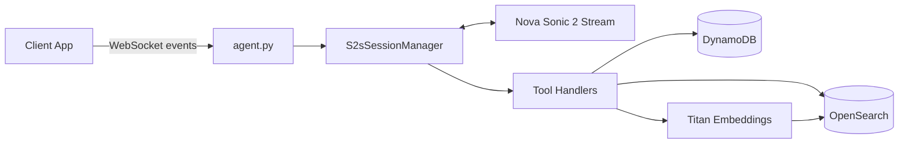

# Clarity Voice Agent

Speech-to-speech AI calendar agent for Clarity ([useclarity.io](https://useclarity.io)), built on AWS Bedrock AgentCore + Nova Sonic 2.

## Why this project matters

Most voice assistants struggle with natural, paraphrased scheduling commands and recurring-event edits. This agent is designed to handle those cases in real time by combining:
- low-latency speech streaming,
- tool-augmented calendar CRUD,
- vector search for fuzzy event resolution,
- recurrence-aware update logic.

## What I built

- WebSocket-based real-time voice session orchestration.
- Bedrock streaming integration for speech-to-speech responses.
- Tools for calendar operations:
  - Create events
  - Read events
  - Update events
  - Delete events
- Hybrid event retrieval using OpenSearch + Titan embeddings.
- Recurring-event logic for both one-off edits and this-and-future changes.

## High-level architecture



## Tech stack

- Python 3.12
- Fast API (WebSocket server)
- AWS Bedrock AgentCore + Bedrock Runtime
- Amazon Nova Sonic 2 (speech-to-speech)
- Amazon Titan Embeddings (`amazon.titan-embed-text-v1`)
- DynamoDB
- OpenSearch
- Pydantic
- Pytest

## Project layout

- `src/agent.py` — app entrypoint and WebSocket lifecycle
- `src/s2s_session_manager.py` — real-time stream/session orchestration + tool execution
- `src/s2s_events.py` — event payload helpers
- `src/tools/` — calendar CRUD tool implementations
- `src/models/repeating_event_config_model.py` — recurrence models/validation
- `src/models/event_model.py` - calendar event models/validation
- `src/utils.py` — date math + DynamoDB serialization helpers
- `tests/` — unit tests for tool and date logic

## Local development

### Prerequisites

- Python 3.12.4
- AWS credentials with permissions for Bedrock, DynamoDB, and OpenSearch

### 1) Create and activate virtual environment

```bash
python -m venv .venv
source .venv/bin/activate
```

### 2) Install dependencies

```bash
pip install -r requirements.txt
```

### 3) Set environment variables

```bash
export AWS_ACCESS_KEY_ID=<your_access_key_id>
export AWS_SECRET_ACCESS_KEY=<your_secret_access_key>
# Optional, if needed in your AWS setup:
export AWS_REGION=<your_region>
```

### 4) Run locally (without Docker)

```bash
python src/agent.py
```

### 5) Run with Docker

```bash
docker build -f .bedrock_agentcore/clarityAgent/Dockerfile -t clarity-agent:local .
docker run --rm -it -p 8080:8080 \
  -e AWS_ACCESS_KEY_ID=<aws_access_key_id> \
  -e AWS_SECRET_ACCESS_KEY=<aws_secret_access_key> \
  -e AWS_REGION=<aws_region> \
  --name clarity-agent-local clarity-agent:local
```

## Tests

Run the test suite:

```bash
pytest -q
```

Key areas covered include recurring-event date calculations and update/delete behavior for complex scheduling scenarios.

## Deploy to AWS Bedrock AgentCore

```bash
agentcore configure -e src/agent.py
agentcore launch
```

## Current limitations

- Assumes AWS services and indexes/tables are already provisioned.
- Requires valid AWS credentials in the runtime environment.
- Focused on backend/agent logic (no client UI in this repo).

## License

This project is licensed under the MIT License. See `LICENSE` for details.